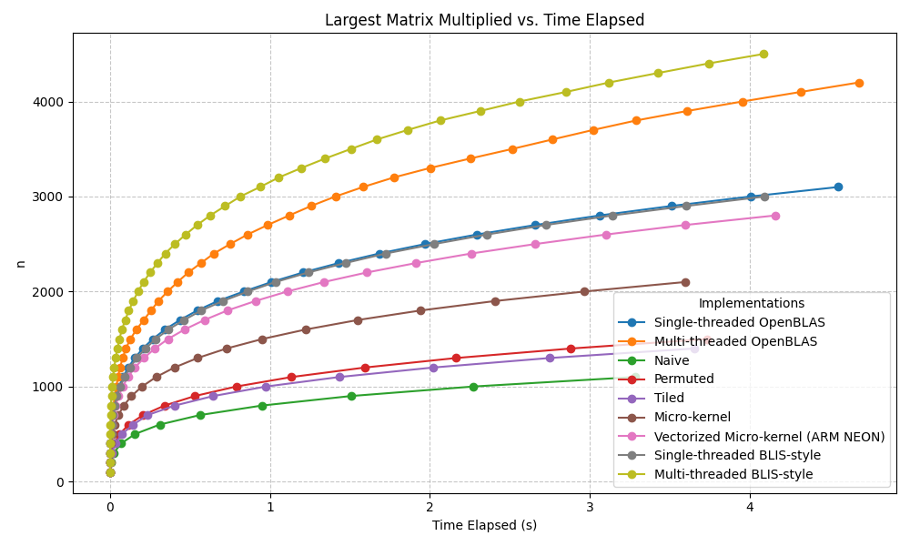

# fast_matmul

I've written a deep dive into each optimization and the intuition/benchmarks behind them [here](https://ninjadenmu.github.io/systems/machine-learning/fast-matmul/)

`src/` contains 7 files that progressively build from a naive matrix multiplication implementation to a BLIS-style implementation with cache blocking, register blocking, ARM NEON vectorization, and multi-threaded parallelization that's ~200x faster (40x faster with just one thread) on my Apple M4.  The fastest implementation also significantly outperforms generic versions of OpenBLAS built for Apple Silicon.  

`scripts/` contains a benchmarking script and simple autotuning script that can use random and grid search to set cache blocking parameters (currently configured to find good `mc`, `nc`, and `kc` values for the BLIS implementations, although it can theoretically tune any run-time parameters).  However, the autotuner is not particularly capable, and I find that reasonable values chosen by hand lead to similar performance to the results of autotuning.

Currently, all compile-time and run-time parameters are tuned for the Apple M4.  However, the implementations themselves are fairly generic, and the parameters are designed to be easily changed for experimentation.  

The makefile should work out of the box for recent Apple Silicon machines, but may require some edits to how it links with OpenMP depending on your system.

Upon compilation, a `bench` executable will be created.  The scripts rely on this executable, and it may also be invoked by the user with the following interface:
`./bench <implementation_name> <n (matrix dimension)> <number of trys to average performance statistics across>`

The implementation names are:
- `naive`: a straightforwad i-j-k loop nest
- `permuted`: a j-k-i loop nest that dramatically improves cache utilization (matrices are stored column-major)
- `tiled`: uses 3 outer loops to tile matrices, allowing all values within active tiles to remain cache-resident
- `micro_kernel`: uses 3 outer loops to tile matrices, and 2 inner loops to break tiles into blocks that fit in registers which are consumed by a micro-kernel, reducing LD/ST pressure and improving potential instruction level parallelism
- `vectorized`: vectorizes the micro-kernel using ARM NEON intrinsics
- `blis`: a single-threaded BLIS-style implementation with packing (reducing TLB misses) and improved cache behavior
- `parallel`: a multi-threaded BLIS-style implementation
